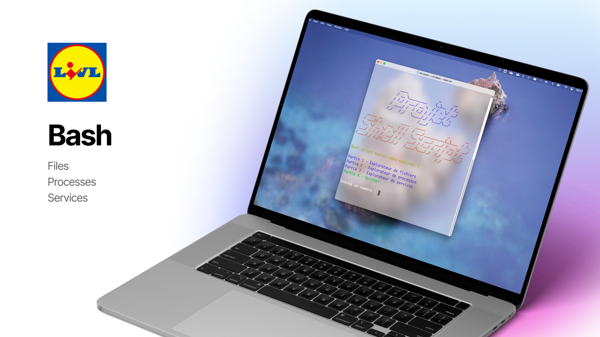
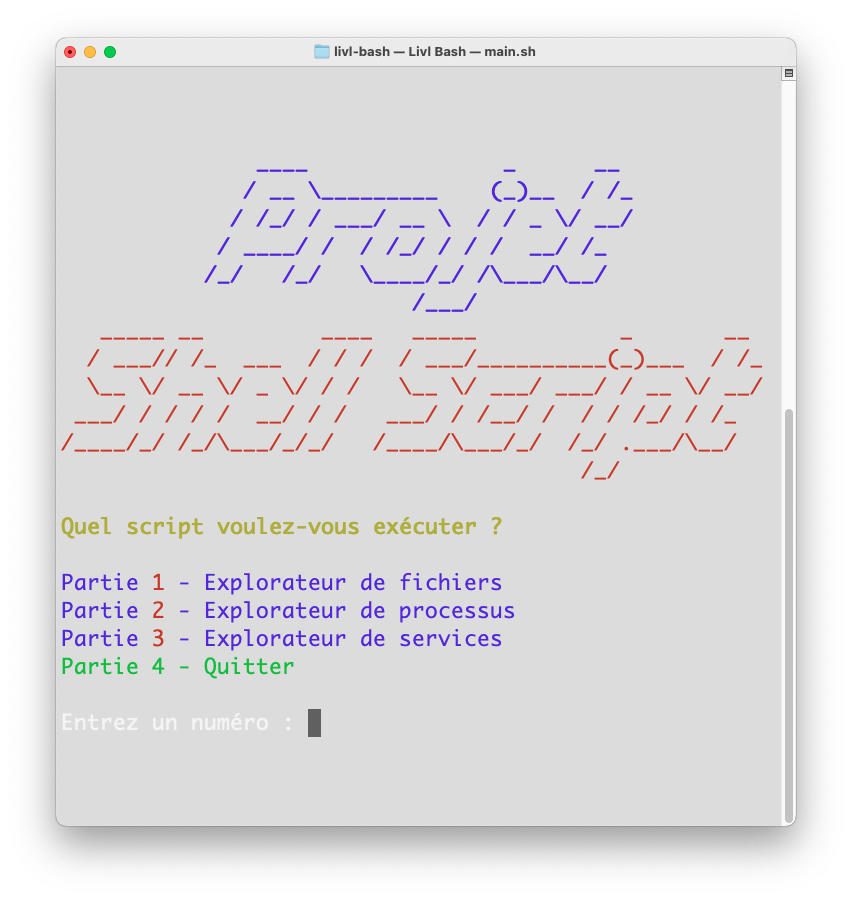

## What is Livl Bash ?

Livl Bash is a collection of bash utilities interfaces about files, processes and services.
A complete list of the utilities is available in the [project description](PROJECT.md).

## Requirements

* Unix based system
* Bash 4.3+

The services utilities require the `systemctl` service manager. It is not available on MacOS.

## How to use it ?

Run `main.sh` to open the main menu and choose the utility you want to use.

You can also directly launch one of the utility scripts :

* `files.sh`
* `processes.sh`
* `services.sh`

## Project team

<table align="center">
    <tr>
        <th> <strong>@FranckG28</strong></th>
        <th> <strong>@jvondermarck</strong></th>
    </tr>
    <tr align="center">
        <td><b>Franck Gutmann</b></td>
        <td><b>Julien Von Der Marck</b></td>
  </tr>
</table>
